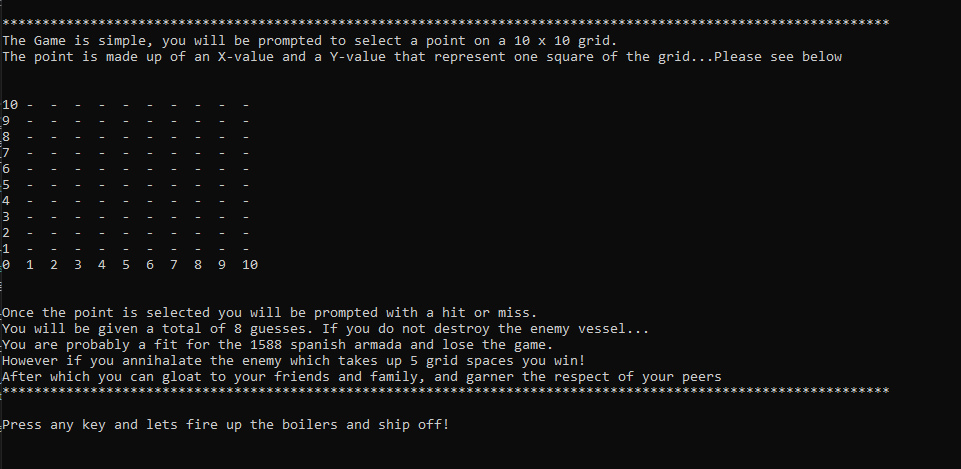
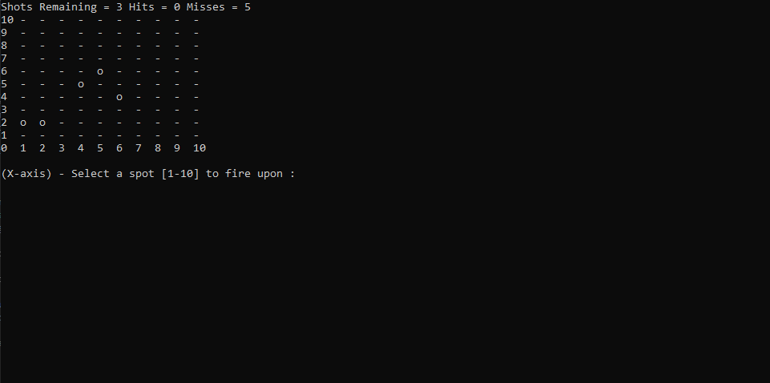
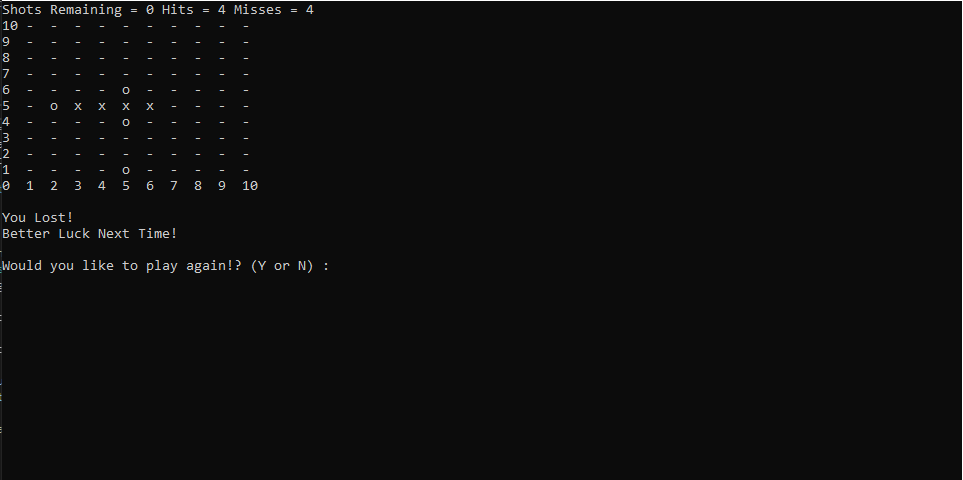

# Battleship Game
The console application was built using C#

## Summary
This battleship game is a console application that was built using C#. The purpose was to experiment with C# and to get a better understanding of the logic behind game play. As well as exposure to a new language that can be used for window applications as well as web development.

## How to play the Game:
The player is prompted to select a point on a 10 x 10 grid to fire upon. The point is made up of an X-value and a Y-value that represent one square of the grid. Once the point is selected the player is prompted with a hit or miss. When the screen refreshes the grid will be updated with the players selection marked on the grid. The grid will mark an 'x' as a hit and 'o' for a miss. The player will be given a total of 8 guesses. The game will run until there are no more guesses remaining. After which the player can choose to try again or quit the game.

## Author
Heriberto Cuellar – Full Stack Software Developer - [LinkedIn](linkedin.com/in/heriberto-c-5aa11952)